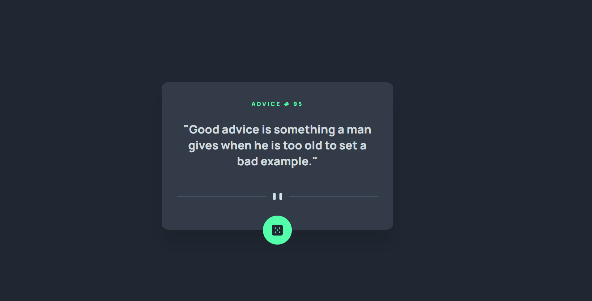

# Frontend Mentor - Advice generator app solution

This is a solution to the [Advice generator app challenge on Frontend Mentor](https://www.frontendmentor.io/challenges/advice-generator-app-QdUG-13db). Frontend Mentor challenges help you improve your coding skills by building realistic projects.

## Table of contents

- [Overview](#overview)
  - [The challenge](#the-challenge)
  - [Screenshot](#screenshot)
  - [Links](#links)
- [My process](#my-process)
  - [Built with](#built-with)
  - [What I learned](#what-i-learned)
- [Author](#author)

## Overview

### The challenge

Users should be able to:

- View the optimal layout for the app depending on their device's screen size
- See hover states for all interactive elements on the page
- Generate a new piece of advice by clicking the dice icon

### Screenshot



### Links

- Live Site URL: [Advice Generator](https://challenge-advice.netlify.app/)

## My process

### Built with

- Semantic HTML5 markup
- CSS custom properties
- Flexbox
- [React](https://reactjs.org/) - JS library

### What I learned

In this challenge I created a custom hook to get the advice, and that way encapsulate the logic outside the component and use it more than once without repeating code. I still need to work in fetch request error handling. Learning about 'Suspense' in React is another way to achieve the challenge to work with APIs. I also enjoy the opportunity to continue learning about CSS. It´s very helpful to have a design to follow and try to replicate it

```js
export function useAdvice() {
  const [advice, setAdvice] = useState({ id: null, advice: "" });
  const [isLoading, setIsLoading] = useState(false);

  const getAdvice = () => {
    setIsLoading(true);
    fetch(ADVICE_URL)
      .then((res) => res.json())
      .then((data) => {
        setIsLoading(false);
        setAdvice(data.slip);
      });
  };

  return { advice, isLoading, getAdvice };
}
```

## Author

- Frontend Mentor - [@Ailin-Glez](https://www.frontendmentor.io/profile/Ailin-Glez)
- Linkedin - [Ailin Garcia](https://www.linkedin.com/in/ailin-garcía-gonzález-600b46168)
